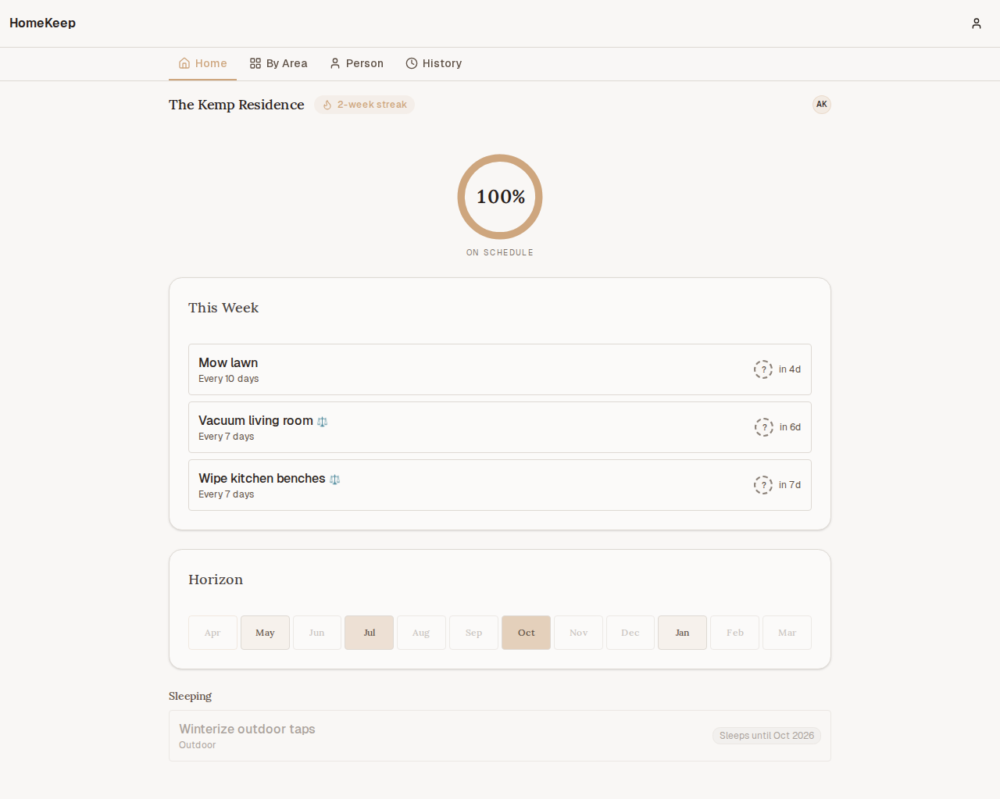
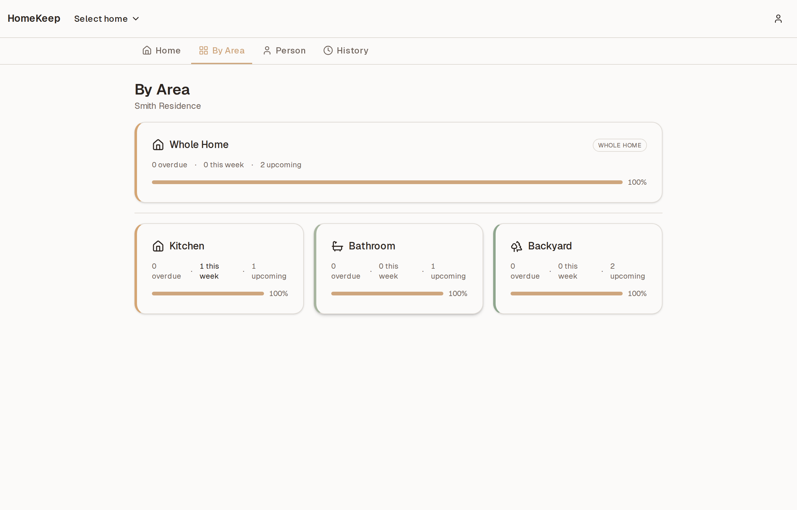
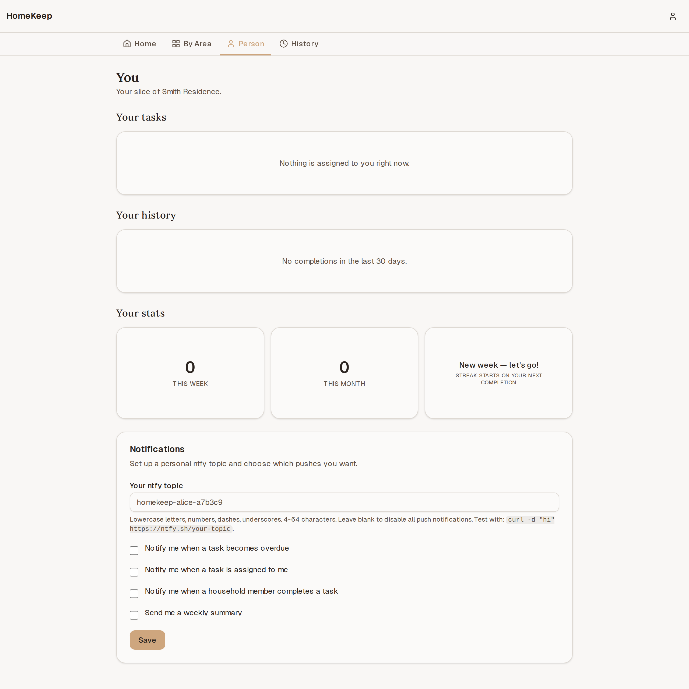
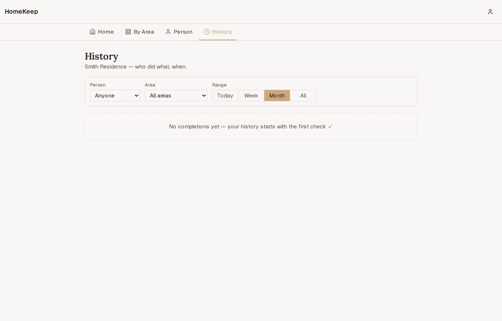
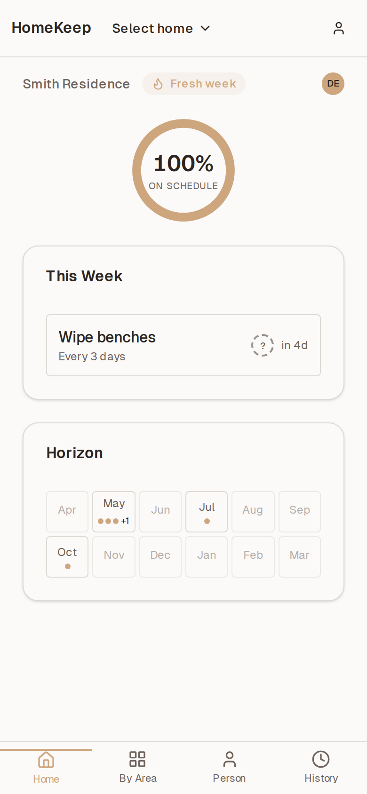

# HomeKeep

> A calm, self-hosted household maintenance PWA for couples and families. Every recurring chore has a frequency, and HomeKeep spreads the year's work evenly across weeks so nothing piles up and nothing rots.

<p align="center">
  
</p>

<p align="center">
  <a href="https://github.com/conroyke56/homekeep/actions"></a>
  
  
  
  
</p>

---

## What it is

A small weekend project that grew into a full v1. Existing task apps (Apple Reminders, Todoist) treat a task due in 365 days the same as one due today — everything lives in the same list, so you either ignore it or get overwhelmed. HomeKeep separates **what's due now** from **what's coming eventually**, and turns the whole year of home maintenance into a steady rhythm instead of a guilt pile.

Built for people who self-host things and want ownership of their data. AGPL v3, public repo, no cloud dependencies, no telemetry, no paid APIs.

## Guiding principles

1. **Calm over urgent.** Reduces anxiety, not creates it. No red badges on things that aren't actually overdue.
2. **Shared, not competitive.** Streaks and progress are "us vs. the house," never partner-vs-partner.
3. **Forgiveness built in.** Miss a week? The app redistributes, doesn't scold.

## Feature tour

### Three-band main view

The core interaction. **Overdue** (shown only if anything actually is), **This Week**, and a 12-month **Horizon** strip — so you can see what's next without being nagged about a task due in November.


### By Area — which part of the house needs love

Coverage percent per area (Kitchen 100%, Backyard 60%). "Whole Home" pinned to top.



### Person — your slice

Tasks assigned to you (via cascade: task-level → area default → anyone), your recent history, your personal streak, your notification prefs.



### History — who did what and when

A filterable timeline of household completions. Settles the "did you ever actually do that?" conversation.



### Mobile

Stock PWA. Installs to the home screen on iOS/Android under HTTPS deploys.

<p align="center">
  
</p>

## What's in the box

- **Three-band view** (Overdue / This Week / Horizon) + household coverage ring
- **Cycle vs. anchored** scheduling per task (cleaning benches resets the cycle; annual smoke alarm test sticks to its fixed calendar)
- **Early-completion guard** — prompts "Are you sure?" if you mark a task done less than 25% into its cycle (catches double-taps and "did my partner already do this?")
- **Collaboration** — invite links, member management, cascading assignment (task-level > area-default > "Anyone")
- **By Area / Person / History views** — same data, different lenses
- **First-run onboarding wizard** with ~30 seed tasks covering Kitchen, Bathroom, Living, Yards, and Whole Home
- **Gentle gamification** — household streak, per-area coverage %, one-time celebration when an area first hits 100%, "most neglected" gentle nudge
- **Push notifications** via [ntfy](https://ntfy.sh) — overdue, newly-assigned, partner-completed (opt-in), weekly Sunday summary (opt-in). No Firebase, no APNs, no paid services.
- **Installable PWA** on HTTPS deployments; graceful HTTP degradation on LAN-only
- **Append-only completion history** — nothing is ever deleted

## Stack

- Next.js 16 (App Router, Server Components, Server Actions) + React 19
- PocketBase 0.37 (SQLite + migrations-as-code + JSVM hooks) — single binary, lives in the same container
- Tailwind 4 + shadcn/ui — soft neutrals, one warm accent (#D4A574 terracotta-sand)
- Zod + react-hook-form, @dnd-kit for drag-to-reorder
- node-cron for the hourly scheduler, ntfy for push
- s6-overlay supervises Caddy + PocketBase + Next.js inside one container
- Vitest (unit) + Playwright (E2E); 311 unit + 23 E2E tests

## Quickstart

### Option 1 — `docker run` (fastest)

```bash
docker run -d -p 3000:3000 \
  -v homekeep_data:/app/data \
  -e SITE_URL=http://localhost:3000 \
  -e NTFY_URL=https://ntfy.sh \
  --name homekeep \
  ghcr.io/conroyke56/homekeep:latest
```

Open <http://localhost:3000>, sign up, create a home. The PocketBase admin UI lives at `/_/` — on first boot check the container logs for an installer link.

### Option 2 — `docker compose up` (LAN)

```bash
git clone https://github.com/conroyke56/homekeep.git
cd homekeep
cp .env.example docker/.env   # edit docker/.env as needed
docker compose -f docker/docker-compose.yml up -d
```

The default compose runs on `HOST_PORT` (3000 by default). Data lives in the `homekeep_data` named volume — survives restarts.

### Option 3 — HTTPS via Caddy

Point a domain at your server and:

```bash
export DOMAIN=homekeep.example.com
docker compose \
  -f docker/docker-compose.yml \
  -f docker/docker-compose.caddy.yml \
  up -d
```

Caddy handles TLS automatically via Let's Encrypt. See [`docs/deployment.md`](docs/deployment.md) for tuning, or [`docker/docker-compose.tailscale.yml`](docker/docker-compose.tailscale.yml) for the Tailscale-funnel variant.

## Environment variables

Minimum:

| Var | Required | Default | Notes |
|---|---|---|---|
| `SITE_URL` | yes | — | Absolute URL (e.g. `https://homekeep.example.com`). Used in invite links. |
| `NTFY_URL` | no | `https://ntfy.sh` | Override for self-hosted ntfy. |
| `PB_ADMIN_EMAIL` | yes for invites | — | PocketBase superuser — the invite-acceptance path needs admin context. |
| `PB_ADMIN_PASSWORD` | yes for invites | — | Paired with above. Create with `docker exec <container> pocketbase superuser upsert <email> <pass>`. |
| `ADMIN_SCHEDULER_TOKEN` | no | — | 32+ char string. Lets you manually trigger the scheduler via `POST /api/admin/run-scheduler`. |
| `SMTP_HOST` / `SMTP_PORT` / `SMTP_USER` / `SMTP_PASS` | no | — | Enables password-reset + (future) email notifications. If unset, password reset no-ops gracefully. |
| `HOST_PORT` | no | `3000` | Host-side port when using docker-compose. |
| `TZ` | no | `Etc/UTC` | Host timezone. Per-home timezone still comes from the home record. |

Full reference in [`.env.example`](.env.example).

## Architecture

Single Docker image. Inside the container:

```
 ┌─────────────────────────────────────────────┐
 │  s6-overlay (PID 1)                         │
 │  ├── Caddy :3000   (path-based router)      │
 │  │     ├─  /api/health → Next.js            │
 │  │     ├─  /api/* + /_/* → PocketBase       │
 │  │     └─  everything else → Next.js        │
 │  ├── Next.js :3001 (standalone, loopback)   │
 │  └── PocketBase :8090 (loopback)            │
 │        ├─ /app/pb_migrations (schema)       │
 │        └─ /app/pb_hooks (JSVM lifecycle)    │
 │  /app/data → persistent volume               │
 └─────────────────────────────────────────────┘
```

Read more in [`docs/deployment.md`](docs/deployment.md) and the per-phase summaries in [`.planning/phases/`](.planning/phases/).

## Development

```bash
npm install
npm run dev          # Next.js + PocketBase side-by-side
npm test             # Vitest
npm run test:e2e     # Playwright (boots a disposable PB)
npm run build        # production build (uses webpack for Serwist)
npm run lint && npm run type-check
```

PocketBase runs as a local binary under `./.pb/pocketbase` via `scripts/dev-pb.js`. Migrations live in `pocketbase/pb_migrations/`, hooks in `pocketbase/pb_hooks/`.

## Project status

v1.0.0-rc1. All 7 planned phases shipped:

| Phase | What it delivered |
|---|---|
| 1 | Docker + Next + PocketBase + Caddy + s6 + multi-arch CI |
| 2 | Signup, homes, areas, tasks, computed next-due |
| 3 | Three-band dashboard + one-tap complete + early-completion guard + coverage ring |
| 4 | Invite links + members + cascading assignment |
| 5 | By Area / Person / History views + onboarding wizard |
| 6 | ntfy notifications + scheduler + streaks + celebrations |
| 7 | PWA manifest + service worker + HTTP banner + Caddy/Tailscale compose overlays |

Decimal phases (2.1, 3.1, …) are deploy checkpoints — build the image and stand it up on the VPS between features so you can actually look at the thing.

## Known limits

- Password-reset emails only work if you configure SMTP.
- PWA install prompts only appear on HTTPS deployments (browser restriction — that's why the HTTP banner exists).
- Multi-instance deploys aren't supported yet — the scheduler assumes one container.
- Offline-writes is not in v1. You can read cached pages offline, but edits require a connection.

## Contributing

This is a small fun project, not a startup. PRs welcome — keep it calm and read [CONTRIBUTING.md](CONTRIBUTING.md) first. Open an issue before any big change so we don't duplicate effort.

If the app helps you keep your house, let me know — no tracking, no analytics, so the only feedback loop I have is people telling me.

## License

[AGPL v3](LICENSE). Self-host freely. Modify freely. If you run a modified
version of HomeKeep as a public service, the AGPL asks that you publish your
modifications so users of that service can see what's running. Same spirit as
the rest of the project: transparent, self-hostable, yours to change — just
keep the changes visible to the people you serve.

## Provenance

Every HomeKeep build ships a small, static, zero-telemetry JSON probe at
`/.well-known/homekeep.json`. It returns the app name, source repo URL,
license, and the unique build UUID baked into that image at Docker build
time. No phone-home, no analytics — the endpoint only responds to a request
made directly to the serving host.

```bash
curl -fsS https://your-homekeep.example.com/.well-known/homekeep.json
# => {"app":"HomeKeep","repo":"https://github.com/conroyke56/homekeep","license":"AGPL-3.0-or-later","build":"hk-<uuid>"}
```

If you ever come across HomeKeep running on a domain that isn't yours or
mine, that endpoint is the fastest way to see where it was built and to
verify the AGPL license declaration. A `build` value of `hk-dev-local` means
someone rebuilt the image without passing the `HK_BUILD_ID` build-arg — a
signal (not proof) that the deploy isn't from an official release.

## Credits

- Written during a few long evenings with [Claude Code](https://claude.com/claude-code) driving the build (the whole thing was scaffolded, researched, planned, and implemented via GSD — see `.planning/` for the phase-by-phase paper trail).
- Inspired by every task app that nagged me about annual gutter cleaning in July.
- Thanks to [PocketBase](https://pocketbase.io), [ntfy](https://ntfy.sh), [shadcn/ui](https://ui.shadcn.com), and [s6-overlay](https://github.com/just-containers/s6-overlay) for doing the heavy lifting.
