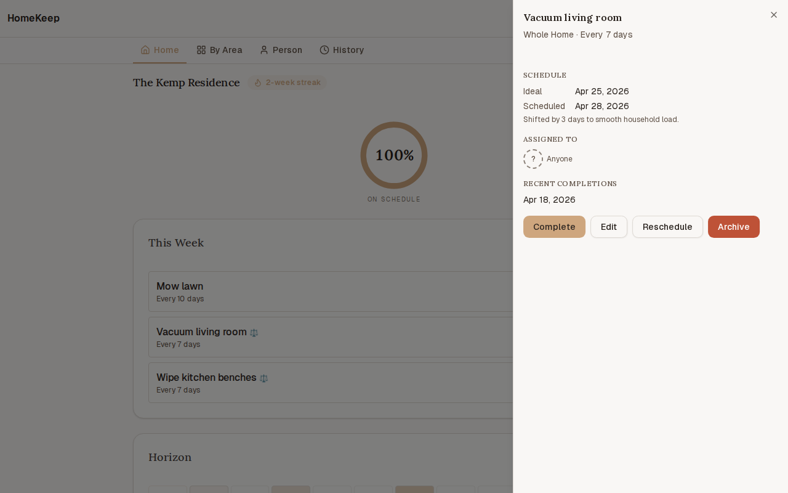
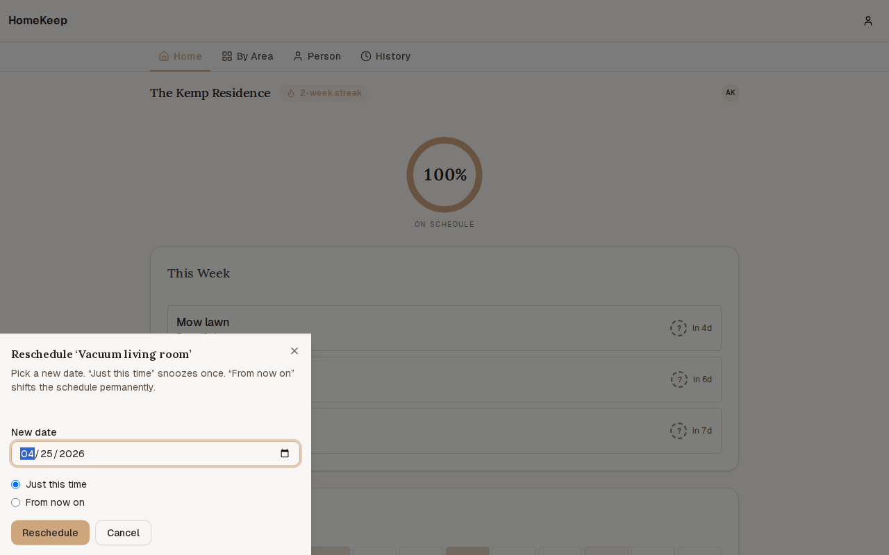
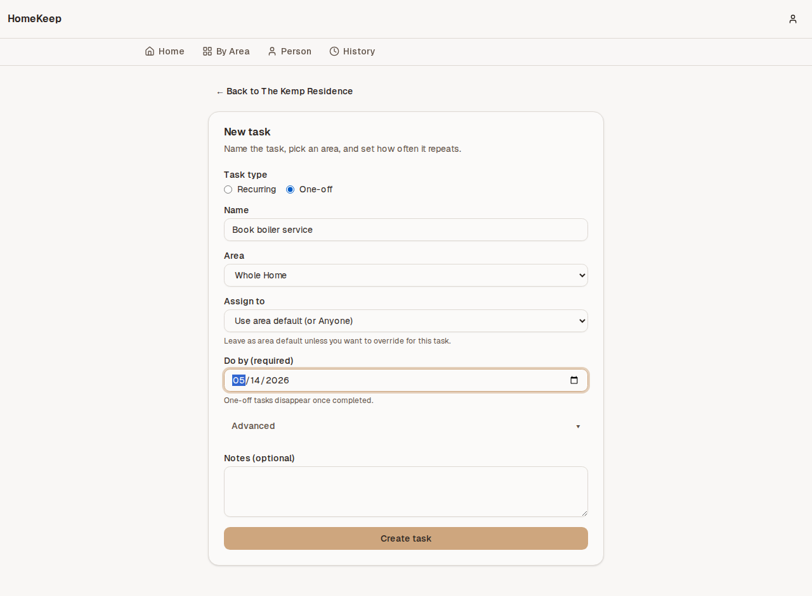
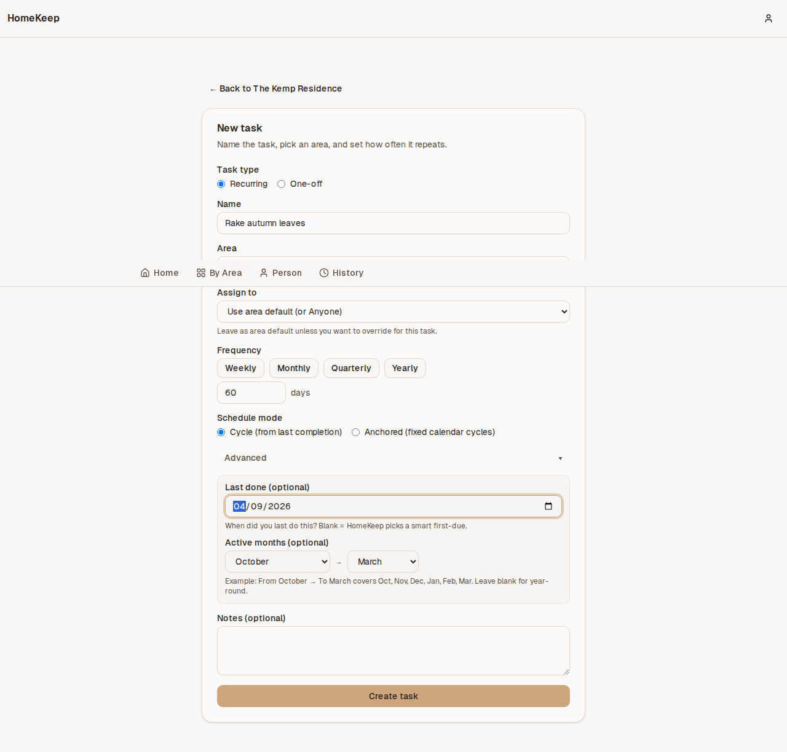
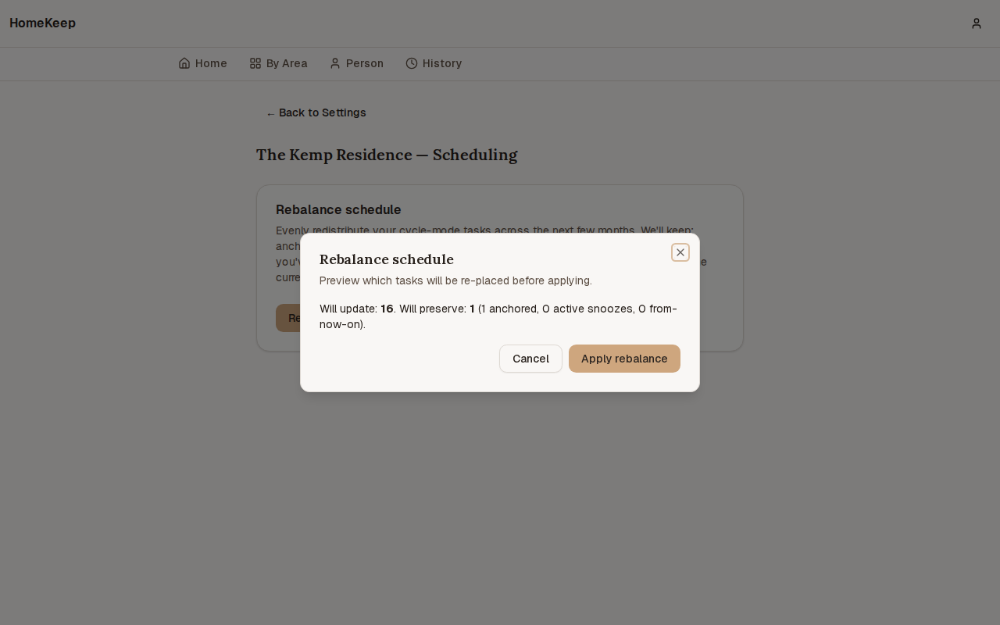
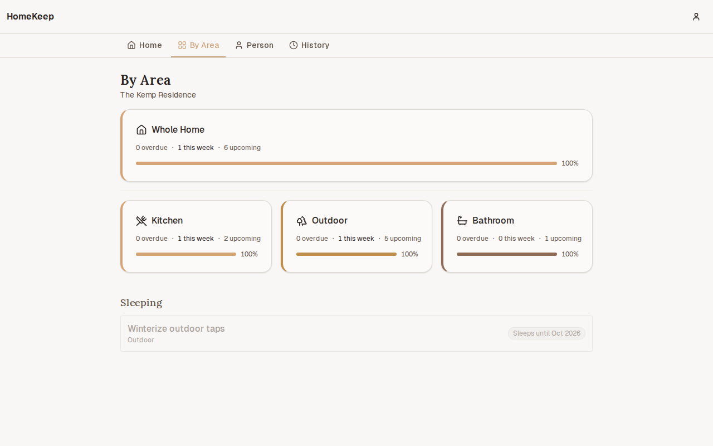
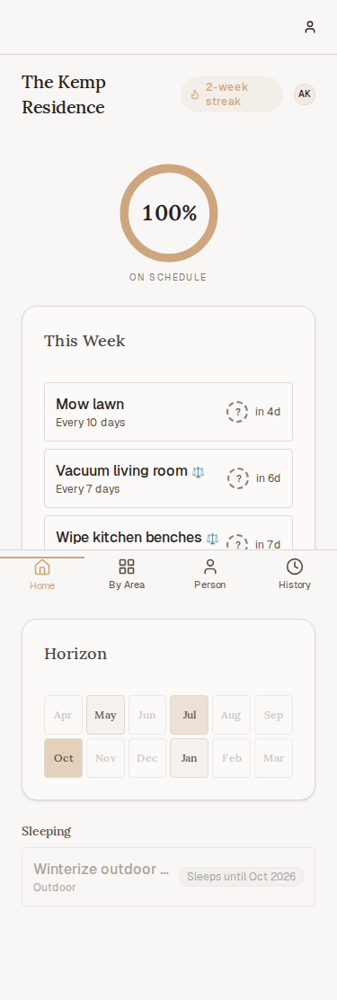

# HomeKeep

> A calm, self-hosted household maintenance PWA for couples and families. Every recurring chore has a frequency, and HomeKeep spreads the year's work evenly across weeks so nothing piles up and nothing rots.

<p align="center">
  
</p>

<p align="center">
  <a href="https://github.com/the-kizz/homekeep/releases"></a>
  <a href="https://github.com/the-kizz/homekeep/actions"></a>
  
  
  
  
</p>

---

## What it is

A small weekend project that grew into a full v1. Existing task apps (Apple Reminders, Todoist) treat a task due in 365 days the same as one due today — everything lives in the same list, so you either ignore it or get overwhelmed. HomeKeep separates **what's due now** from **what's coming eventually**, and turns the whole year of home maintenance into a steady rhythm instead of a guilt pile.

Built for people who self-host things and want ownership of their data. AGPL v3, public repo, no cloud dependencies, no telemetry, no paid APIs.

## Guiding principles

1. **Calm over urgent.** Reduces anxiety, not creates it. No red badges on things that aren't actually overdue.
2. **Shared, not competitive.** Streaks and progress are "us vs. the house," never partner-vs-partner.
3. **Forgiveness built in.** Miss a week? The app redistributes, doesn't scold.

## What's new in v1.1 — Scheduling & Flexibility

The big idea: **spread the year's work evenly across weeks**. v1.0 kept tasks separate by band; v1.1 makes the app actively smooth household load so you don't get six annual tasks all landing on the same Saturday.

### Load-smoothed horizon

A per-month density tint on the Horizon strip shows you, at a glance, which months are heavy and which are light. Any task that the smoother shifted off its natural date wears a ⚖️ badge — tap the task to see `Ideal: Apr 25 / Scheduled: Apr 28 / Shifted by 3 days`. Nothing silent, nothing magic.

<p align="center">
  
</p>

<p align="center">
  
</p>

### Reschedule any task from any view

"Just this time" writes a one-off snooze that auto-consumes when you next complete the task. "From now on" permanently shifts the task's anchor / smoothed date and is preserved across future rebalances (it won't undo your intent).

<p align="center">
  
</p>

### One-off tasks

Not everything is recurring. Toggle the form to **One-off** for single-shot tasks with an explicit "Do by" date — they auto-archive on completion, contribute to the load map while they're pending, and never clog the cycle tasks list.

<p align="center">
  
</p>

### Seasonal tasks

Set active months on any task (e.g. **October → March** for winter tasks). Out of season, tasks render dimmed with "Sleeps until Mar 2027" — they don't nag, don't drag the coverage ring, and wake up automatically on the first day of their window.

<p align="center">
  
</p>

### Manual rebalance

When life drifts and your schedule gets lumpy, Settings → Scheduling → **Rebalance schedule**. Preview first ("Will update: 16 / Will preserve: 1 anchored") — Apply re-places everything eligible while respecting anchored tasks, active snoozes, and "From now on" intent.

<p align="center">
  
</p>

### The rest of v1.0 still here

By Area, Person, History, coverage ring, early-completion guard, cascading assignment, seed library (now with 4 seasonal pairs), ntfy notifications, mobile PWA. Nothing removed. v1.0 data migrates forward with zero changes; anchored-mode tasks are byte-identical.

<p align="center">
  
  
</p>

## What's in the box

- **Three-band dashboard** (Overdue / This Week / Horizon) + household coverage ring
- **Load-smoothed scheduling** (v1.1) — `placeNextDue` algorithm with `min(0.15 × frequency, 5)` tolerance window, forward-only, deterministic tiebreakers, &lt;100ms budget for 100-task households
- **Six-branch `computeNextDue`**: archived → override → smoothed → seasonal-dormant → seasonal-wakeup → one-off → cycle/anchored
- **Cycle vs. anchored** scheduling per task (cleaning benches resets the cycle; annual smoke alarm test sticks to its fixed calendar — anchored bypasses smoothing by design)
- **One-off tasks** (v1.1) with explicit due date, atomic archive-on-completion
- **Seasonal dormancy** (v1.1) with cross-year-wrap support (Oct→Mar windows) and coverage-ring exclusion
- **Snooze + permanent reschedule** (v1.1) — action sheet from any task row; history-preserving `schedule_overrides` collection; cross-season snooze warns with ExtendWindowDialog
- **Preferred days** (v1.1) — optional `any / weekend / weekday` hard constraint; smoother narrows candidates before scoring by load
- **Manual rebalance** (v1.1) — counts-only preview + 4-bucket preservation (anchored / active-snooze / from-now-on / rebalanceable); idempotent after first run
- **Early-completion guard** — prompts "Are you sure?" under 25% of cycle
- **Collaboration** — invite links, member management, cascading assignment (task-level > area-default > "Anyone")
- **First-run onboarding wizard** — ~30 seed tasks including 4 seasonal pairs (warm/cool mowing, summer/winter HVAC)
- **Gentle gamification** — household streak, per-area coverage %, area-100% celebration, "most neglected" nudge
- **Push notifications** via [ntfy](https://ntfy.sh) — overdue, newly-assigned, partner-completed (opt-in), weekly summary (opt-in)
- **Installable PWA** on HTTPS deployments; graceful HTTP degradation on LAN-only
- **Append-only completion history** — nothing is ever deleted; dormant-task completions still show in History regardless of current season state

## Stack

- Next.js 16 (App Router, Server Components, Server Actions) + React 19
- PocketBase 0.37 (SQLite + migrations-as-code + JSVM hooks) — single binary, lives in the same container
- Tailwind 4 + shadcn/ui — soft neutrals, one warm accent (#D4A574 terracotta-sand)
- Zod + react-hook-form, @dnd-kit for drag-to-reorder
- node-cron for the hourly scheduler, ntfy for push
- s6-overlay supervises Caddy + PocketBase + Next.js inside one container
- Vitest (unit) + Playwright (E2E); 598 unit + 23 E2E tests (v1.1)

## Quickstart

### Option 1 — `docker run` (fastest)

```bash
docker run -d -p 3000:3000 \
  -v homekeep_data:/app/data \
  -e SITE_URL=http://localhost:3000 \
  -e NTFY_URL=https://ntfy.sh \
  --name homekeep --restart unless-stopped \
  ghcr.io/the-kizz/homekeep:latest
```

Open <http://localhost:3000>, sign up, create a home. The PocketBase admin UI lives at `/_/` — on first boot check the container logs for an installer link.

### Image tags (pick your channel)

| Tag | What it is | Good for |
|---|---|---|
| `:latest` | Most recent **stable** release. No RCs, no betas. | Default — what you want unless you know otherwise. |
| `:rc` | Most recent release candidate. Moving pointer. | Early-access; might break. |
| `:edge` | Auto-built from every push to `master`. Bleeding edge. | Trying the unreleased HEAD; expect breakage. |
| `:1` | Latest patch of major version 1. Auto-updates within `1.x.x`. | Conservative auto-updates (bugfixes only). |
| `:1.0` | Latest patch of `1.0.x`. Never crosses minor. | Very conservative — only `1.0.<next>` patches. |
| `:1.0.0`, `:1.0.0-rc1`, … | Exact version pin. Never changes. | Production; reproducibility. |

Model borrowed from Plex, Nextcloud, Grafana, Postgres. `:latest` is **stable**, not nightly.

### Option 2 — `docker compose up` (LAN)

Drop this file anywhere as `docker-compose.yml` — no clone required:

```yaml
services:
  homekeep:
    image: ghcr.io/the-kizz/homekeep:latest
    container_name: homekeep
    restart: unless-stopped
    ports:
      - "3000:3000"
    volumes:
      - homekeep_data:/app/data
    environment:
      SITE_URL: http://localhost:3000
      NTFY_URL: https://ntfy.sh
      TZ: Australia/Perth
    healthcheck:
      test: ["CMD", "curl", "-fsS", "http://127.0.0.1:3000/api/health"]
      interval: 30s
      timeout: 5s
      retries: 3
      start_period: 30s

volumes:
  homekeep_data:
```

Then `docker compose up -d`. Data lives in the `homekeep_data` named volume — survives restarts and upgrades.

**Or clone the repo** if you want the full LAN/Caddy/Tailscale overlay set:

```bash
git clone https://github.com/the-kizz/homekeep.git
cd homekeep
cp .env.example docker/.env   # edit as needed
docker compose -f docker/docker-compose.yml up -d
```

### Option 3 — HTTPS via Caddy

Point a domain at your server and:

```bash
export DOMAIN=homekeep.example.com
docker compose \
  -f docker/docker-compose.yml \
  -f docker/docker-compose.caddy.yml \
  up -d
```

Caddy handles TLS automatically via Let's Encrypt. See [`docs/deployment.md`](docs/deployment.md) for tuning, or [`docker/docker-compose.tailscale.yml`](docker/docker-compose.tailscale.yml) for the Tailscale-funnel variant.

## Environment variables

Minimum:

| Var | Required | Default | Notes |
|---|---|---|---|
| `SITE_URL` | yes | — | Absolute URL (e.g. `https://homekeep.example.com`). Used in invite links. |
| `NTFY_URL` | no | `https://ntfy.sh` | Override for self-hosted ntfy. |
| `PB_ADMIN_EMAIL` | yes for invites | — | PocketBase superuser — the invite-acceptance path needs admin context. |
| `PB_ADMIN_PASSWORD` | yes for invites | — | Paired with above. Create with `docker exec <container> pocketbase superuser upsert <email> <pass>`. |
| `ADMIN_SCHEDULER_TOKEN` | no | — | 32+ char string. Lets you manually trigger the scheduler via `POST /api/admin/run-scheduler`. |
| `SMTP_HOST` / `SMTP_PORT` / `SMTP_USER` / `SMTP_PASS` | no | — | Enables password-reset + (future) email notifications. If unset, password reset no-ops gracefully. |
| `HOST_PORT` | no | `3000` | Host-side port when using docker-compose. |
| `TZ` | no | `Etc/UTC` | Host timezone. Per-home timezone still comes from the home record. |

Full reference in [`.env.example`](.env.example).

## Architecture

Single Docker image. Inside the container:

```
 ┌─────────────────────────────────────────────┐
 │  s6-overlay (PID 1)                         │
 │  ├── Caddy :3000   (path-based router)      │
 │  │     ├─  /api/health → Next.js            │
 │  │     ├─  /api/* + /_/* → PocketBase       │
 │  │     └─  everything else → Next.js        │
 │  ├── Next.js :3001 (standalone, loopback)   │
 │  └── PocketBase :8090 (loopback)            │
 │        ├─ /app/pb_migrations (schema)       │
 │        └─ /app/pb_hooks (JSVM lifecycle)    │
 │  /app/data → persistent volume               │
 └─────────────────────────────────────────────┘
```

Read more in [`docs/deployment.md`](docs/deployment.md) and the per-phase summaries in [`.planning/phases/`](.planning/phases/).

## Development

```bash
npm install
npm run dev          # Next.js + PocketBase side-by-side
npm test             # Vitest
npm run test:e2e     # Playwright (boots a disposable PB)
npm run build        # production build (uses webpack for Serwist)
npm run lint && npm run type-check
```

PocketBase runs as a local binary under `./.pb/pocketbase` via `scripts/dev-pb.js`. Migrations live in `pocketbase/pb_migrations/`, hooks in `pocketbase/pb_hooks/`.

## Project status

v1.0.0-rc1. All 7 planned phases shipped:

| Phase | What it delivered |
|---|---|
| 1 | Docker + Next + PocketBase + Caddy + s6 + multi-arch CI |
| 2 | Signup, homes, areas, tasks, computed next-due |
| 3 | Three-band dashboard + one-tap complete + early-completion guard + coverage ring |
| 4 | Invite links + members + cascading assignment |
| 5 | By Area / Person / History views + onboarding wizard |
| 6 | ntfy notifications + scheduler + streaks + celebrations |
| 7 | PWA manifest + service worker + HTTP banner + Caddy/Tailscale compose overlays |

Decimal phases (2.1, 3.1, …) are deploy checkpoints — build the image and stand it up on the VPS between features so you can actually look at the thing.

## Known limits

- Password-reset emails only work if you configure SMTP.
- PWA install prompts only appear on HTTPS deployments (browser restriction — that's why the HTTP banner exists).
- Multi-instance deploys aren't supported yet — the scheduler assumes one container.
- Offline-writes is not in v1. You can read cached pages offline, but edits require a connection.

## Contributing

This is a small fun project, not a startup. PRs welcome — keep it calm and read [CONTRIBUTING.md](CONTRIBUTING.md) first. Open an issue before any big change so we don't duplicate effort.

If the app helps you keep your house, let me know — no tracking, no analytics, so the only feedback loop I have is people telling me.

## License

[AGPL v3](LICENSE). Self-host freely. Modify freely. If you run a modified
version of HomeKeep as a public service, the AGPL asks that you publish your
modifications so users of that service can see what's running. Same spirit as
the rest of the project: transparent, self-hostable, yours to change — just
keep the changes visible to the people you serve.

## Security

Found a vulnerability? See [SECURITY.md](SECURITY.md) for our threat model,
disclosure policy, and response SLA. Operators running HomeKeep on a
public domain should also work through
[`docs/deployment-hardening.md`](docs/deployment-hardening.md) before
cut-over.

## Provenance

Every HomeKeep build ships a small, static, zero-telemetry JSON probe at
`/.well-known/homekeep.json`. It returns the app name, source repo URL,
license, and the unique build UUID baked into that image at Docker build
time. No phone-home, no analytics — the endpoint only responds to a request
made directly to the serving host.

```bash
curl -fsS https://your-homekeep.example.com/.well-known/homekeep.json
# => {"app":"HomeKeep","repo":"https://github.com/the-kizz/homekeep","license":"AGPL-3.0-or-later","build":"hk-<uuid>"}
```

If you ever come across HomeKeep running on a domain that isn't yours or
mine, that endpoint is the fastest way to see where it was built and to
verify the AGPL license declaration. A `build` value of `hk-dev-local` means
someone rebuilt the image without passing the `HK_BUILD_ID` build-arg — a
signal (not proof) that the deploy isn't from an official release.

## Credits

- Written during a few long evenings with [Claude Code](https://claude.com/claude-code) driving the build (the whole thing was scaffolded, researched, planned, and implemented via GSD — see `.planning/` for the phase-by-phase paper trail).
- Inspired by every task app that nagged me about annual gutter cleaning in July.
- Thanks to [PocketBase](https://pocketbase.io), [ntfy](https://ntfy.sh), [shadcn/ui](https://ui.shadcn.com), and [s6-overlay](https://github.com/just-containers/s6-overlay) for doing the heavy lifting.
