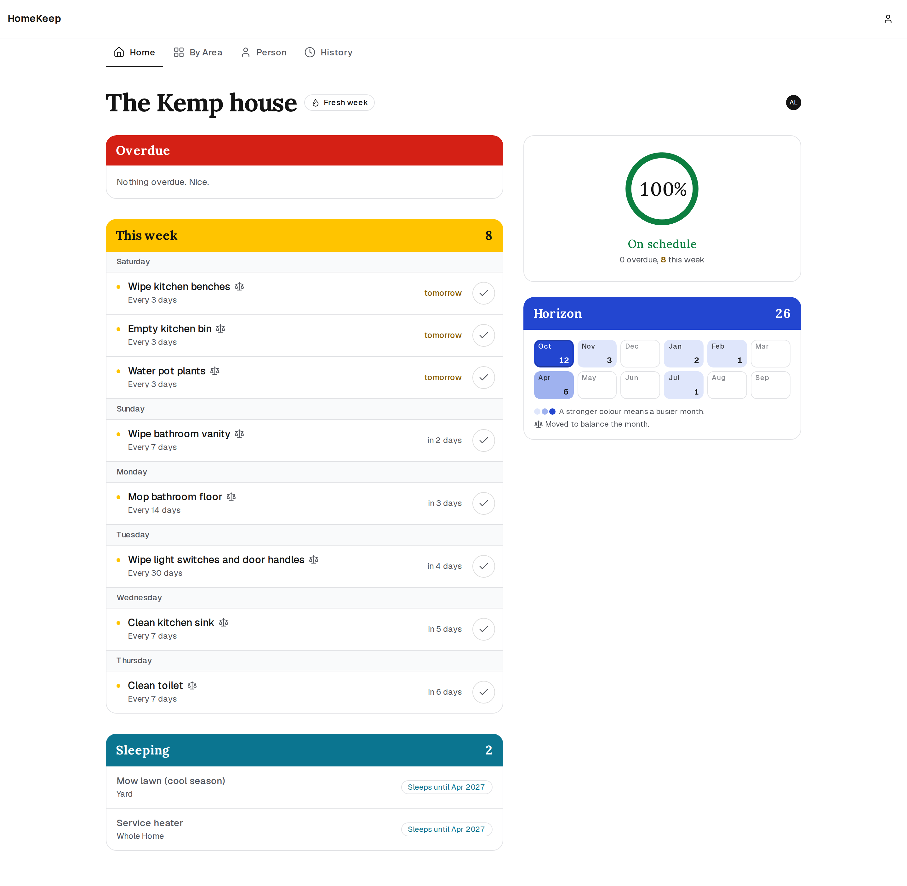
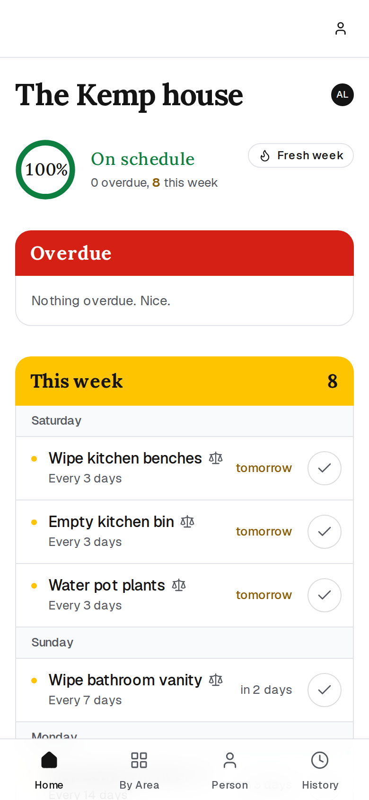
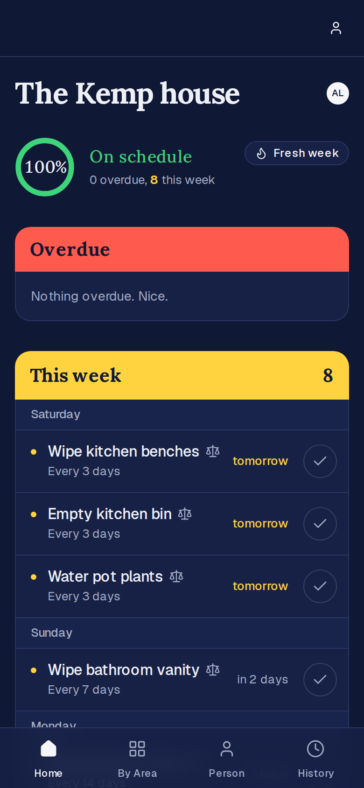
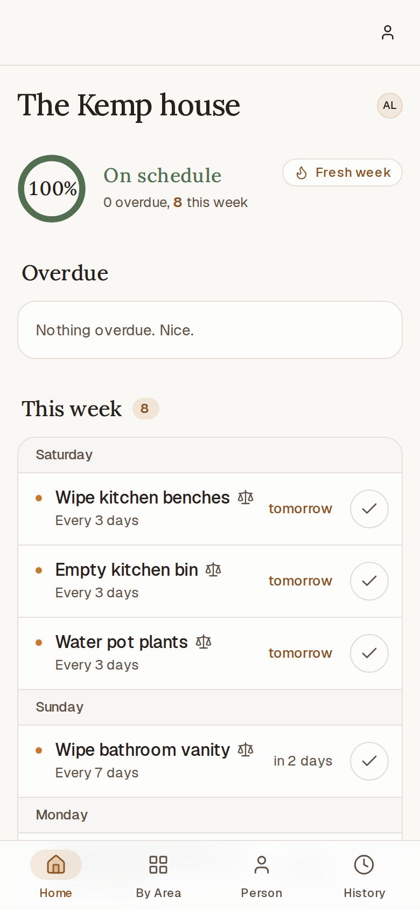
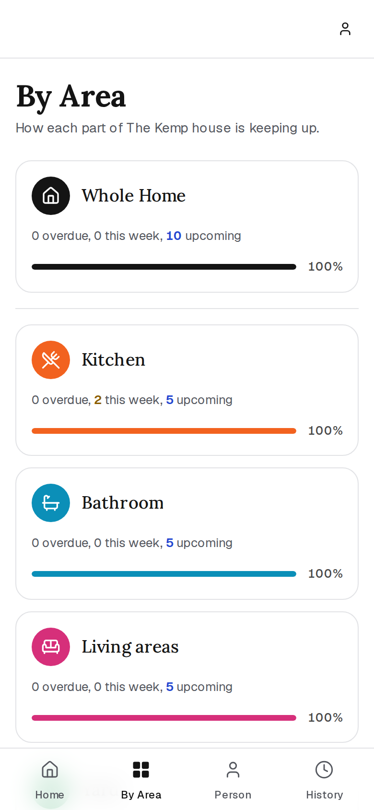
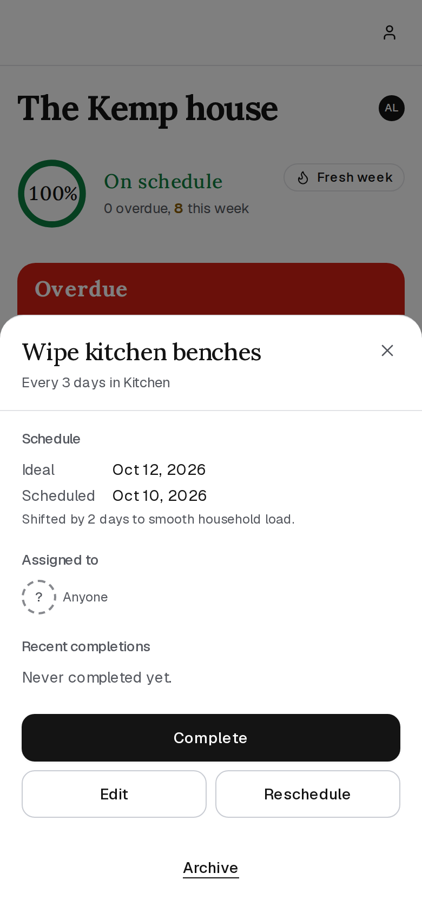
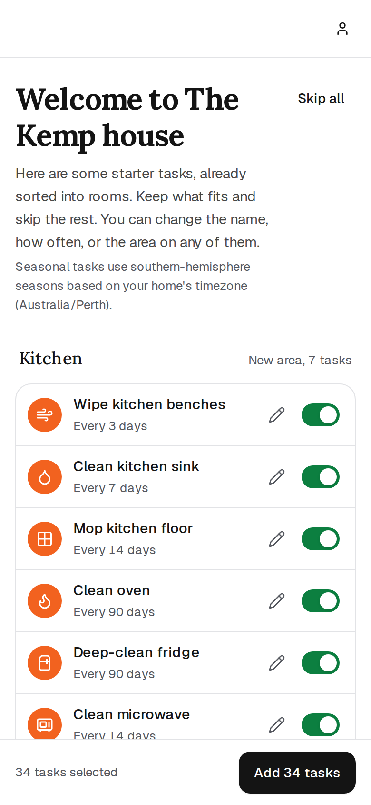
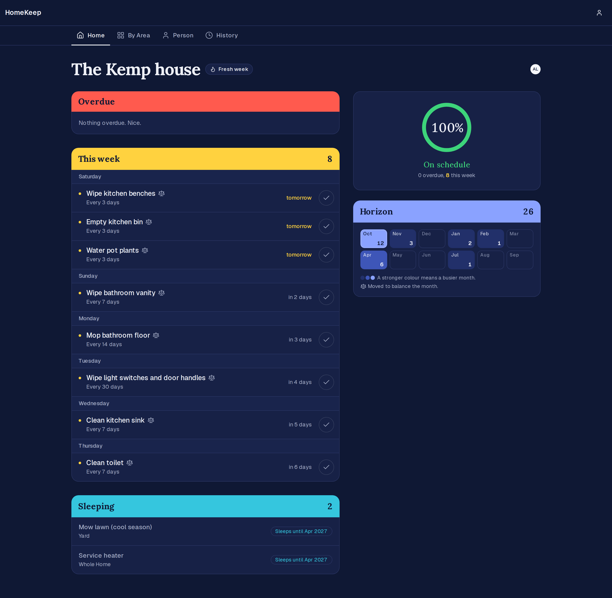

<p align="center">
  <a href="https://github.com/the-kizz/homekeep/releases"></a>
  <a href="https://github.com/the-kizz/homekeep/actions/workflows/ci.yml"></a>
  <a href="https://github.com/the-kizz/homekeep/pkgs/container/homekeep"></a>
  <a href="LICENSE"></a>
  <a href="https://github.com/the-kizz/homekeep/stargazers"></a>
</p>

<h1 align="center">HomeKeep</h1>

<p align="center"><strong>Every recurring job in your home, on one calm list your household shares.</strong><br>
Gutters, smoke alarms, the oven, the lawn. See what slipped, what's due this week, and the whole year ahead.</p>

<p align="center">
  <a href="#quick-start">Quick start</a> ·
  <a href="#screenshots">Screenshots</a> ·
  <a href="docs/deployment.md">Deployment guide</a> ·
  <a href="https://github.com/the-kizz/homekeep/discussions">Discussions</a> ·
  <a href="https://github.com/the-kizz/homekeep/issues/new/choose">Report a bug</a>
</p>

<p align="center">
  
</p>

## Why it exists

To-do apps treat "clean the gutters, every six months" the same as "buy milk". Everything lands in one list, so you either ignore it or drown in it. HomeKeep is built for long-cycle home maintenance: it keeps *now* separate from *eventually*, spreads the year's work so six annual jobs don't all land on one Saturday, and never nags.

Self-hosted, one container, one data folder. No cloud, no telemetry, no paid APIs.

## Features

- **Three bands, not one list.** Overdue, This week, and a twelve-month Horizon that shows how busy each month will be.
- **Load-aware scheduling.** Tasks know about each other. New and completed jobs are placed where the month is light, within a tolerance you'd never notice.
- **Recurring, one-off and seasonal tasks.** "Every 14 days", "do by 3 Nov", or "October to March". Seasonal tasks sleep out of season and wake on time, hemisphere-aware.
- **One-tap complete.** A check on every row, with an "are you sure?" if you just did it.
- **Shared with your household.** Invite by link, assign a task or an area to a person, or leave it to "anyone". Streaks are *us vs the house*, never partner vs partner.
- **Snooze and reschedule.** "Just this time" or "from now on". Manual rebalance when life drifts.
- **Two themes, light and dark.** Bold (bright colour blocks) or Notebook (warm and quiet). Switch before you even sign in.
- **Push notifications via [ntfy](https://ntfy.sh).** Overdue, assigned, partner completed, weekly summary. No Firebase, no accounts.
- **Installable PWA** on HTTPS, usable on plain HTTP on your LAN.
- **Hardened by default.** Signed multi-arch images with SBOM and provenance, security headers, rate limits, admin UI blocked at the edge.

## Quick start

```bash
docker run -d --name homekeep --restart unless-stopped \
  -p 3000:3000 \
  -v homekeep_data:/app/data \
  -e SITE_URL=http://localhost:3000 \
  ghcr.io/the-kizz/homekeep:latest
```

Open <http://localhost:3000>, create an account, name your home, and accept the starter tasks. Two minutes.

<details>
<summary><strong>docker compose</strong></summary>

```yaml
services:
  homekeep:
    image: ghcr.io/the-kizz/homekeep:latest
    container_name: homekeep
    restart: unless-stopped
    ports:
      - "3000:3000"
    volumes:
      - homekeep_data:/app/data
    environment:
      SITE_URL: http://localhost:3000
      TZ: Australia/Perth
volumes:
  homekeep_data:
```

If you bind-mount a host folder instead of a named volume, it must be writable by uid 1000. The container repairs ownership at boot when it can; if `docker logs` shows `permission denied`, run `sudo chown -R 1000:1000 ./data`.
</details>

<details>
<summary><strong>HTTPS with a domain (Caddy) or Tailscale</strong></summary>

```bash
git clone https://github.com/the-kizz/homekeep.git && cd homekeep
cp .env.example docker/.env            # set DOMAIN=homekeep.example.com
docker compose -f docker/docker-compose.yml -f docker/docker-compose.caddy.yml up -d
```

Caddy issues the certificate automatically. The Tailscale overlay is `docker/docker-compose.tailscale.yml`. Read [`docs/deployment-hardening.md`](docs/deployment-hardening.md) before exposing an instance to the internet.
</details>

<details>
<summary><strong>Image tags</strong></summary>

| Tag | Meaning |
|---|---|
| `:latest` | Newest stable release |
| `:1` / `:1.5` | Newest patch within that major / minor |
| `:1.5.0` | Exact pin |
| `:edge` | Every push to `master`; expect breakage |

Every release tag is cosign-signed (keyless, GitHub OIDC) and carries an SPDX SBOM and SLSA provenance. Verify with the command in [SECURITY.md](SECURITY.md).
</details>

## Screenshots

| Bold, phone | Bold dark, phone | Notebook, phone |
|:--:|:--:|:--:|
|  |  |  |

| By area | Task sheet | Onboarding |
|:--:|:--:|:--:|
|  |  |  |

<p align="center"></p>

## Configuration

| Variable | Default | Notes |
|---|---|---|
| `SITE_URL` | required | Public URL, used in invite links and the PWA manifest |
| `TZ` | `Etc/UTC` | Container timezone; each home has its own timezone in the app |
| `NTFY_URL` | `https://ntfy.sh` | Point at a self-hosted ntfy if you have one |
| `PB_ADMIN_EMAIL` / `PB_ADMIN_PASSWORD` | unset | Needed for invite links; create with `docker exec homekeep pocketbase superuser upsert <email> <password>` |
| `SMTP_*` | unset | Enables password reset emails; everything else works without SMTP |
| `PASSWORD_POLICY` | `simple` | `strong` for public-facing instances (12-character floor) |
| `ADMIN_SCHEDULER_TOKEN` | unset | Lets you trigger the scheduler by HTTP for testing |

The full list, with comments, is in [`.env.example`](.env.example).

## How it works

One image, three processes under s6-overlay: Caddy on `:3000` routes `/api/*` to PocketBase and everything else to Next.js. PocketBase holds the SQLite database, migrations and hooks; Next.js renders the app and runs server actions and the hourly scheduler. All state is in `/app/data`, so backup is `cp -r`.

| | |
|---|---|
| Frontend | Next.js 16, React 19, Tailwind 4, shadcn/ui |
| Backend | PocketBase 0.37 (SQLite, migrations as code) |
| Notifications | ntfy |
| Tests | 820+ unit and integration tests (real PocketBase), Playwright end-to-end against the built image |
| Platforms | linux/amd64, linux/arm64 (Raspberry Pi 4 and up) |

## Development

```bash
git clone https://github.com/the-kizz/homekeep.git && cd homekeep
npm install
npm run dev          # Next.js on :3001 plus a local PocketBase on :8090
npm test             # vitest
npm run test:e2e     # Playwright (builds the app first)
```

See [CONTRIBUTING.md](CONTRIBUTING.md) for the principles and the ground rules. Open an issue before a large change.

## Security

Threat model, supported versions and the disclosure process are in [SECURITY.md](SECURITY.md). Report vulnerabilities through GitHub's private reporting on this repository, not in a public issue.

## License

[AGPL-3.0-or-later](LICENSE). Self-host it, change it, share it. If you run a modified HomeKeep as a service for others, publish your changes so they can see what's running.

---

<sub>Built with the help of Claude (Anthropic).</sub>
